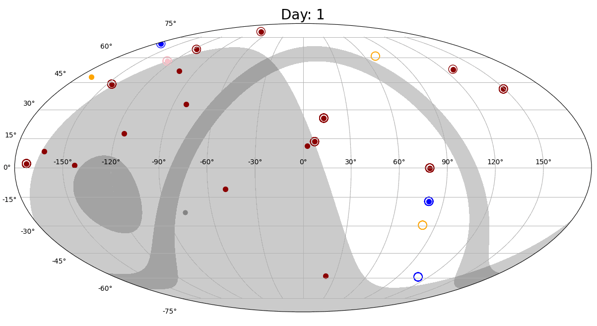

# Slewpy

## License

slewpy is distributed under the terms of the MIT license. All new contributions must be made under the MIT license.

See Link to [license](https://github.com/LLNL/slewpy/blob/main/LICENSE) and [NOTICE](https://github.com/LLNL/slewpy/blob/main/NOTICE) for details.

SPDX-License-Identifier: MIT

LLNL-CODE-2009734
